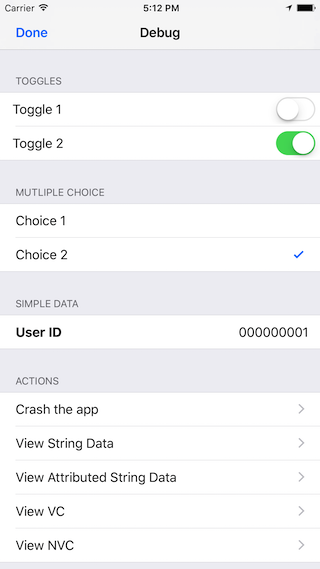

# CardinalDebugToolkit

CardinalDebugToolkit is a small library that can help you quickly create a debug panel for your apps.



Among its features are:

- Toggle switches (i.e. to enable or disable features)
- Multiple choice sections (i.e. to select different backend servers)
- Display small or large amounts of data and copy them to the Pasteboard (i.e. user IDs, device push tokens, etc)
- App provided actions (i.e. reset app data without re-installing the app)
- Simple logging facilities, log file viewer, email log files
- Keychain explorer
- Launch additional app provided debug screens, if you need to go beyond what's provided by CardinalDebugToolkit

Please see the included example project for usage instructions.

## Installation

### CocoaPods

[CocoaPods](http://cocoapods.org) is a dependency manager for Cocoa projects. You can install it with the following command:

```bash
$ gem install cocoapods
```

To integrate CardinalDebugToolkit into your Xcode project using CocoaPods, specify it in your `Podfile`:

```ruby
platform :ios, '10.0'

target '<Your Target Name>' do
    use_frameworks!

    pod 'CardinalDebugToolkit'
end
```

Then, run the following command:

```bash
$ pod install
```
